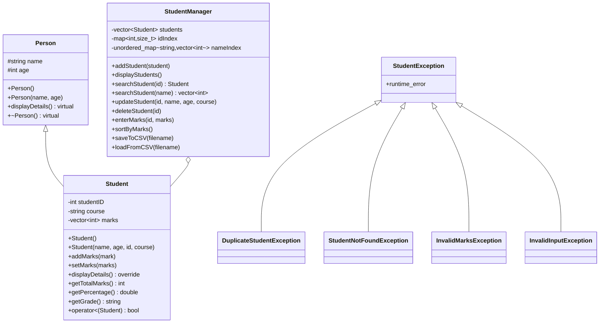

# UML Class Diagram

```mermaid
classDiagram
    class Person {
        #string name
        #int age
        +Person()
        +Person(name, age)
        +displayDetails() virtual
        +~Person() virtual
    }
    class Student {
        -int studentID
        -string course
        -vector~int~ marks
        +Student()
        +Student(name, age, id, course)
        +addMarks(mark)
        +setMarks(marks)
        +displayDetails() override
        +getTotalMarks() int
        +getPercentage() double
        +getGrade() string
        +operator<(Student) bool
    }
    class StudentManager {
        -vector~Student~ students
        -map~int,size_t~ idIndex
        -unordered_map~string,vector~int~~ nameIndex
        +addStudent(student)
        +displayStudents()
        +searchStudent(id) Student
        +searchStudent(name) vector~int~
        +updateStudent(id, name, age, course)
        +deleteStudent(id)
        +enterMarks(id, marks)
        +sortByMarks()
        +saveToCSV(filename)
        +loadFromCSV(filename)
    }
    class StudentException {
        +runtime_error
    }
    class DuplicateStudentException
    class StudentNotFoundException
    class InvalidMarksException
    class InvalidInputException
    Person <|-- Student
    StudentManager o-- Student
    StudentException <|-- DuplicateStudentException
    StudentException <|-- StudentNotFoundException
    StudentException <|-- InvalidMarksException
    StudentException <|-- InvalidInputException
```
